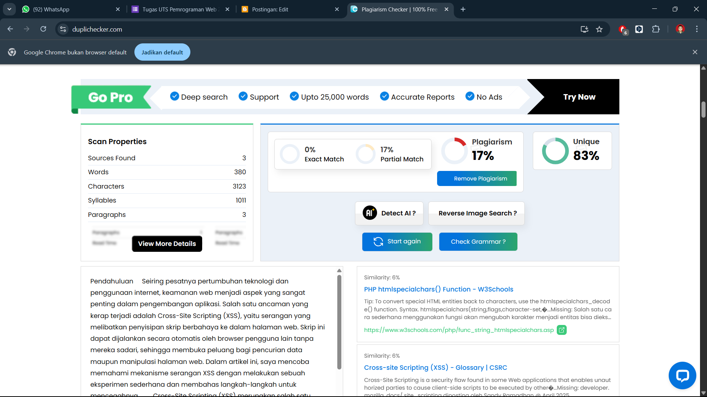

# UTS_Pemrograman_Web2

|             |                                  |
| ----------- | -------------------------------  |
| Nama        | Sandy Ramadhan  |
| NIM         | 312210633                        |
| Kelas       | TI.22.A.4                        |
| Mata Kuliah | Pemrograman Web 2      |

## Mengenal dan Mencoba Cross-Site Scripting (XSS) Serta Cara Mencegahnya 

- Eksperimen ini menunjukkan betapa rentannya sebuah aplikasi web ketika tidak ada validasi atau sanitasi terhadap input dari pengguna. Penyerang bisa dengan mudah menginjeksikan skrip berbahaya, yang dapat digunakan untuk mencuri informasi sensitif atau mengubah tampilan halaman tanpa izin.  

### Strategi Pencegahan XSS

- Untuk mencegah serangan XSS, pengembang harus selalu melakukan validasi dan sanitasi data yang diterima dari pengguna. Salah satu cara sederhana di PHP adalah dengan menggunakan fungsi htmlspecialchars(), yang akan mengubah karakter spesial menjadi entitas HTML, sehingga tidak bisa dieksekusi sebagai kode.

5. Buka browser, akses http://localhost/xss_test.php/  

### Output
Saat eksperimen berhasil, tampilan di browser:

  

Saat eksperimen gagal, tampilan di browser:

  

### Link Artikel Publikasi

Artikel ini telah dipublikasikan di Blogger dan dapat dibaca melalui tautan berikut:  
https://belajarkeamananweb.blogspot.com/

### Bukti Pengecekan Plagiasi

Berikut adalah hasil pengecekan plagiarisme artikel menggunakan DupliChecker:

- Plagiarism Rate: 17%
- Unique Content: 83%

